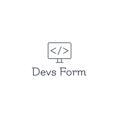
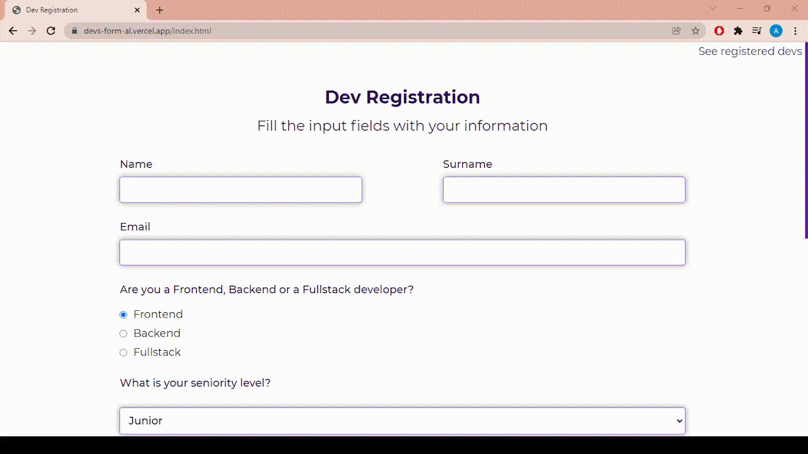
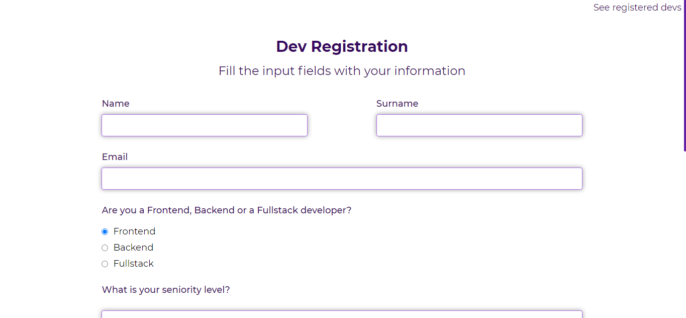
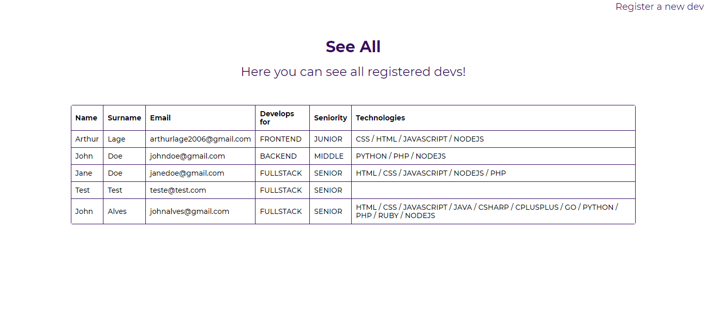
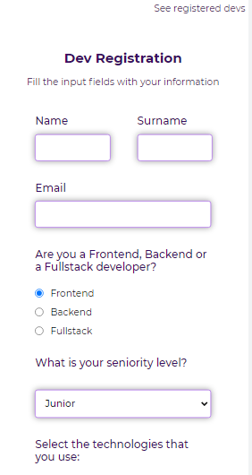
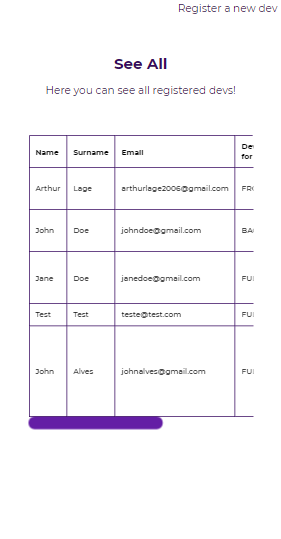

<h1 align="center">
    
</h1>

# ✉ About

A completely responsive website where you can register developers.
You can also see all registered developers in the "See all" page.
Developers are stored in a MongoDB database, and the backend is made with ExpressJS.

# 🌆 GIFs and images

## GIF


# Desktop Screenshots

<div>
    
    
</div>

# Mobile Screenshots

<div>
    
    
</div>

# 👨‍💻👩‍💻 Use the app

You can access the application by clicking on the link below:

[Access Devs Form](https://devs-form-al.vercel.app)

# 🔗 Link for the server side of the project

[Devs Form Server Repository](https://github.com/arthur-lage/devs-form-server)

# 💻 Technologies used in this project

## Client

- HTML 
- CSS
- JavaScript

## Server

- NodeJS
- ExpressJS
- MongoDB

# ❓ How to use it

```bash

git clone https://github.com/arthur-lage/devs-form.git

cd devs-form

```
